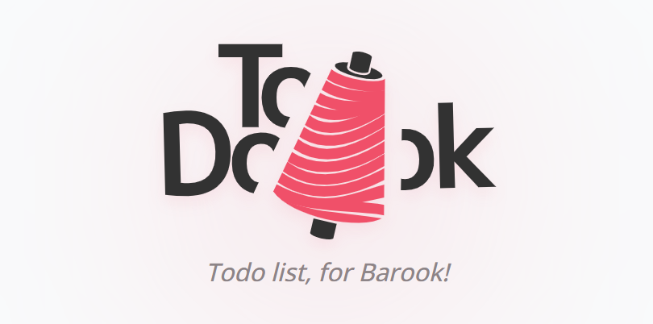
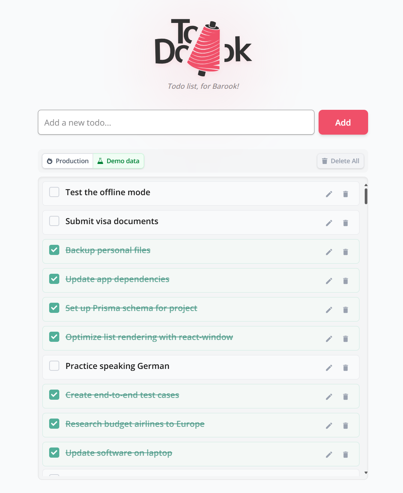
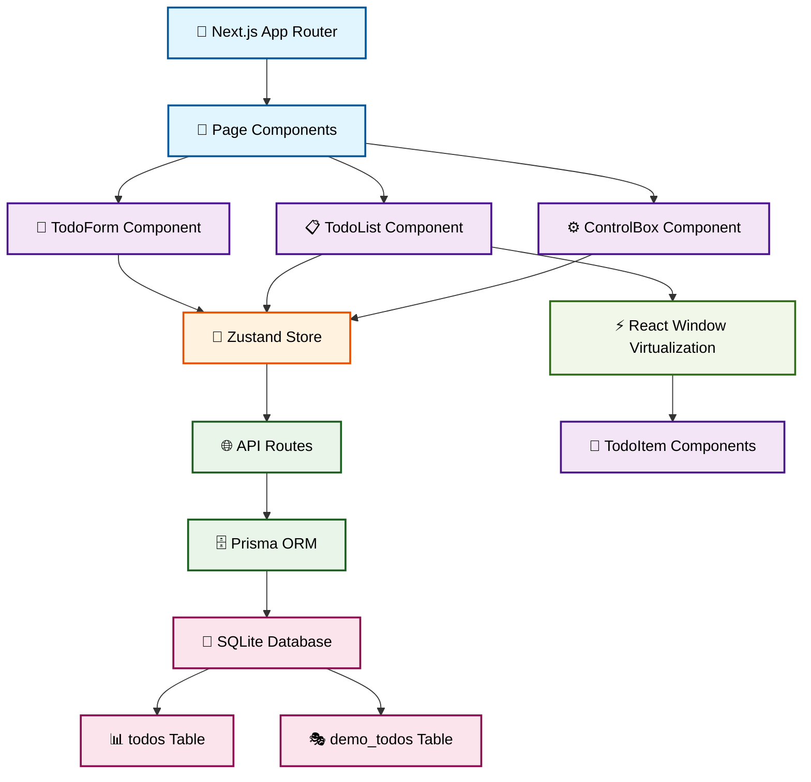

<div align="center">



</div>

# 🧵 Todook - Task Management Application

A task management app built with Next.js 15, featuring virtualization for performance and SQLite data persistence.

## 📑 Table of Contents

- [📋 Overview](#-overview)
- [🎯 Demo & Screenshots](#-demo--screenshots)
- [🏗️ Architecture](#️-architecture)
- [🛠️ Technology Stack](#️-technology-stack)
- [🎯 Key Decisions](#-key-decisions)
- [🚀 Quick Start](#-quick-start)
- [🧪 Testing Strategy](#-testing-strategy)
- [🐳 Docker Support](#-docker-support)
- [📁 Project Structure](#-project-structure)
- [🚀 Deployment](#-deployment)
- [📝 Todo Items](#-todo-items)

## 📋 Overview

Todook delivers a focused task management experience using **Next.js 15** App Router, **Prisma ORM**, and **Zustand** state management. The app includes virtualized rendering for large datasets and **optimistic updates** for responsive interactions.

The application supports individual task organization and includes a dual-mode architecture (production and demo) that demonstrates database switching capabilities while maintaining data integrity.

## 🎯 Demo & Screenshots

**🟢 Live Demo**: [https://todook-turso.vercel.app/](https://todook-turso.vercel.app/)

<div align="center">



</div>

_The Todook logo features a stylized thread spool design, a "Dook"!. The application name, color palette, and visual patterns contain easter egg references to "Barook"._

_The application interface includes add todo functionality, database mode switching (Production/Demo), and a todo list with completion tracking._

## 🏗️ Architecture



## 🛠️ Technology Stack

| Category      | Technology           | Version                  |
| ------------- | -------------------- | ------------------------ |
| **Framework** | Next.js              | 15.5.0                   |
| **Runtime**   | React                | 19.1.0                   |
| **Database**  | SQLite + Prisma      | 6.14.0                   |
| **State**     | Zustand              | 5.0.8                    |
| **Styling**   | Tailwind CSS + MUI   | 4.0 + 7.3.1              |
| **Testing**   | Jest + RTL + Cypress | 29.7.0 + 16.3.0 + 14.5.4 |

### Development Tools

- **Linting**: ESLint 9.0 with Next.js configuration
- **Package Manager**: npm with TypeScript support
- **Build Analysis**: Next.js Bundle Analyzer

## 🎯 Key Decisions

### SQLite over PostgreSQL

**Context**: Required real-world data persistence without excessive complexity
**Why**: Zero-configuration setup with excellent TypeScript integration
**Trade-off**: Simplified deployment and development, but limited concurrent user scalability

### React Window over Infinite Scroll

**Context**: Needed to handle large datasets (200+ todos) without performance degradation
**Why**: Consistent performance regardless of dataset size, enhanced with skeleton loading for fast scrolling scenarios
**Trade-off**: Better performance with large lists and improved UX through skeleton loading, but increased complexity for simple use cases

## 🚀 Quick Start

### Prerequisites

- Node.js v18.0.0+
- npm 9.0.0+

### Setup Commands

```bash
# 1. Clone and enter
git clone https://github.com/b-amir/todook.git
cd todook

# 2. Install dependencies
npm install

# 3. Setup database
npm run db:generate
npm run db:push
npm run db:setup

# 4. Start development
npm run dev
```

Visit `http://localhost:3000` 🎉

### Essential Scripts

| Command            | Purpose            |
| ------------------ | ------------------ |
| `npm run dev`      | Development server |
| `npm run build`    | Production build   |
| `npm run test`     | Unit tests         |
| `npm run test:e2e` | E2E tests          |
| `npm run lint`     | Code quality       |

### Database Management

```bash
# Generate Prisma client
npm run db:generate

# Push schema changes
npm run db:push

# Setup demo data
npm run db:setup

# Open Prisma Studio
npm run db:studio
```

## 🧪 Testing Strategy

**Pyramid Approach**: Unit → Integration → E2E

- **Unit**: Component logic and utility functions using Jest + RTL
- **Integration**: Component interactions and state management
- **E2E**: Critical user journeys using Cypress

The testing strategy implements the **Testing Pyramid** methodology with a focus on **user behavior over implementation details**.

```bash
# Run all tests
npm run test
npm run test:coverage
npm run test:e2e
```

### Test Structure

```
src/
├── components/
│   ├── __tests__/        # Component test files
│   └── ...
└── cypress/
    ├── e2e/             # E2E test specifications
    └── fixtures/        # Test data
```

## 🐳 Docker Support

| Service       | Purpose     | Port |
| ------------- | ----------- | ---- |
| `todook-dev`  | Development | 3000 |
| `todook-prod` | Production  | 3001 |
| `todook-test` | Testing     | -    |

```bash
# Quick start
docker-compose up todook-dev

# Production
docker-compose up todook-prod

# Testing
docker-compose up todook-test
```

## 📁 Project Structure

```
todook/
├── public/                 # Static assets and logo
│   ├── logo.svg           # Application logo
│   └── manifest.json      # PWA manifest
├── src/
│   ├── app/              # Next.js App Router pages
│   │   ├── api/          # API route handlers
│   │   ├── globals.css   # Global styles
│   │   ├── layout.tsx    # Root layout component
│   │   └── page.tsx      # Home page component
│   ├── components/       # Reusable UI components
│   │   ├── todo-form/    # Todo creation form
│   │   ├── todo-list/    # Virtualized todo list
│   │   ├── todo-item/    # Individual todo component
│   │   ├── control-box/  # Database mode controls
│   │   └── ui/           # Base UI components
│   ├── store/            # Zustand state management
│   ├── types/            # TypeScript type definitions
│   └── lib/              # Utility functions
├── prisma/               # Database schema and migrations
└── cypress/              # E2E test specifications
```

## 🚀 Deployment

### Build Process

```bash
# Create production build
npm run build

# Start production server
npm run start
```

### Environment Configuration

| Environment Variable | Description               | Default         |
| -------------------- | ------------------------- | --------------- |
| `DATABASE_URL`       | SQLite database file path | `file:./dev.db` |
| `NODE_ENV`           | Application environment   | `development`   |

### Performance Optimizations

- **Virtualization**: React Window for rendering large lists efficiently
- **Optimistic Updates**: UI feedback with automatic rollback on errors
- **Code Splitting**: Route-based code splitting for reduced bundle sizes
- **Bundle Analysis**: Bundle analyzer for monitoring application size

**Performance Targets**: Sub-2-second initial load, optimized for typical task management use cases

## 📝 Todo Items

### Performance Enhancements

- Implement React DevTools Profiler analysis to identify and eliminate unnecessary re-renders
- Integrate React Scan package for deeper performance monitoring and optimization

### Accessibility Improvements

- Enhance semantic HTML structure throughout the application
- Implement comprehensive accessibility (a11y) features including ARIA labels and keyboard navigation
