<div align="center">


</div>

# Todook - Task Management Application

A task management application built with Next.js 15. The application provides todo organization functionality with performance optimizations including virtualization and SQLite data persistence.

## Overview

Todook provides a task management experience focused on simplicity and functionality. The application uses **Next.js 15** App Router, **Prisma ORM**, and **Zustand** state management to implement modern web development practices. Performance considerations include virtualized rendering for large datasets and **optimistic updates** for responsive user interactions.

The application supports individual task organization and includes a dual-mode architecture (production and demo) that demonstrates database switching capabilities while maintaining data integrity.

## Demo & Screenshots

### Live Demo

- **Live Demo**: [Deploy URL when available]

### Application Preview

_The Todook logo features a stylized thread spool design, a "Dook"!. The application name, color palette, and visual patterns contain easter egg references to "Barook"._

<div align="center">


</div>

_The application interface includes add todo functionality, database mode switching (Production/Demo), and a todo list with completion tracking._

### Architecture Overview

```mermaid
flowchart TD
    %% Styling definitions
    classDef frontend fill:#e1f5fe,stroke:#01579b,stroke-width:2px,color:#000
    classDef component fill:#f3e5f5,stroke:#4a148c,stroke-width:2px,color:#000
    classDef state fill:#fff3e0,stroke:#e65100,stroke-width:2px,color:#000
    classDef api fill:#e8f5e8,stroke:#1b5e20,stroke-width:2px,color:#000
    classDef database fill:#fce4ec,stroke:#880e4f,stroke-width:2px,color:#000
    classDef performance fill:#f1f8e9,stroke:#33691e,stroke-width:2px,color:#000

    %% Main architecture flow
    A["🚀 Next.js App Router"] --> B["📄 Page Components"]
    B --> C["📝 TodoForm Component"]
    B --> D["📋 TodoList Component"]
    B --> E["⚙️ ControlBox Component"]

    %% State management
    C --> F["🔄 Zustand Store"]
    D --> F
    E --> F

    %% Backend flow
    F --> G["🌐 API Routes"]
    G --> H["🗄️ Prisma ORM"]
    H --> I["💾 SQLite Database"]

    %% Database tables
    I --> J["📊 todos Table"]
    I --> K["🎭 demo_todos Table"]

    %% Performance optimization
    D --> L["⚡ React Window Virtualization"]
    L --> M["🎯 TodoItem Components"]

    %% Apply styling
    class A,B frontend
    class C,D,E,M component
    class F state
    class G,H api
    class I,J,K database
    class L performance
```



## Technology Stack

### Core Technologies

- **Frontend Framework**: Next.js 15.5.0 with App Router
- **Runtime**: React 19.1.0 with Server Components
- **Database**: SQLite with Prisma 6.14.0 ORM
- **State Management**: Zustand 5.0.8
- **Styling**: Tailwind CSS 4.0 + Material-UI 7.3.1
- **Type System**: TypeScript 5.0
- **Form Handling**: React Hook Form 7.62.0 with Zod validation

### Development Tools

- **Testing**: Jest 29.7.0 + React Testing Library 16.3.0
- **E2E Testing**: Cypress 14.5.4
- **Linting**: ESLint 9.0 with Next.js configuration
- **Package Manager**: npm with TypeScript support
- **Build Analysis**: Next.js Bundle Analyzer

### Key Architectural Decisions

#### Decision: SQLite with Prisma over PostgreSQL

**Context**: Required real-world data persistence without excessive complexity
**Options Considered**: PostgreSQL, MongoDB, SQLite, Supabase
**Decision**: Selected SQLite with Prisma for zero-configuration setup and excellent TypeScript integration
**Trade-offs**: Simplified deployment and development, but limited concurrent user scalability

#### Decision: React Window Virtualization over Infinite Scroll

**Context**: Needed to handle large datasets (200+ todos) without performance degradation while maintaining excellent UX
**Options Considered**: Infinite scroll, pagination, virtualization
**Decision**: Implemented React Window for consistent performance regardless of dataset size, enhanced with skeleton loading for fast scrolling scenarios and demo dataset for testing
**Trade-offs**: Better performance with large lists and improved UX through skeleton loading, but increased complexity for simple use cases

## Project Structure

```
todook/
├── public/                 # Static assets and logo
│   ├── logo.svg           # Application logo
│   └── manifest.json      # PWA manifest
├── src/
│   ├── app/              # Next.js App Router pages
│   │   ├── api/          # API route handlers
│   │   │   ├── todos/    # Todo CRUD operations
│   │   │   └── database/ # Database management
│   │   ├── globals.css   # Global styles
│   │   ├── layout.tsx    # Root layout component
│   │   └── page.tsx      # Home page component
│   ├── components/       # Reusable UI components
│   │   ├── todo-form/    # Todo creation form
│   │   ├── todo-list/    # Virtualized todo list
│   │   ├── todo-item/    # Individual todo component
│   │   ├── control-box/  # Database mode controls
│   │   ├── ui/           # Base UI components
│   │   └── common/       # Shared components
│   ├── store/            # Zustand state management
│   │   └── todoStore.ts  # Todo state and actions
│   ├── types/            # TypeScript type definitions
│   ├── lib/              # Utility functions
│   ├── hooks/            # Custom React hooks
│   └── constants/        # Application constants
├── prisma/               # Database schema and migrations
│   ├── schema.prisma     # Database schema
│   └── sample-todos.json # Demo data
├── cypress/              # E2E test specifications
└── scripts/              # Database setup utilities
```

### Component Architecture

```mermaid
flowchart TD
    %% Styling definitions
    classDef page fill:#e3f2fd,stroke:#1565c0,stroke-width:3px,color:#000
    classDef component fill:#f3e5f5,stroke:#7b1fa2,stroke-width:2px,color:#000
    classDef error fill:#ffebee,stroke:#c62828,stroke-width:2px,color:#000
    classDef state fill:#fff8e1,stroke:#f57f17,stroke-width:2px,color:#000
    classDef api fill:#e8f5e8,stroke:#2e7d32,stroke-width:2px,color:#000
    classDef database fill:#fce4ec,stroke:#ad1457,stroke-width:2px,color:#000
    classDef performance fill:#f1f8e9,stroke:#558b2f,stroke-width:2px,color:#000

    %% Main page structure
    A["🏠 HomePage"] --> B["🎨 Logo Component"]
    A --> C["🛡️ ErrorBoundary"]

    %% Error boundary children
    C --> D["📝 TodoForm"]
    C --> E["⚙️ ControlBox"]
    C --> F["📋 TodoList"]

    %% State management connections
    D --> G["🔄 Zustand Store"]
    E --> G
    F --> G

    %% Performance optimization
    F --> H["⚡ React Window"]
    H --> I["🎯 TodoItem Components"]

    %% Backend data flow
    G --> J["🌐 API Routes"]
    J --> K["🗄️ Prisma Client"]
    K --> L["💾 SQLite Database"]

    %% Apply styling
    class A page
    class B,D,E,I component
    class C error
    class G state
    class J,K api
    class L database
    class H performance
```



## Getting Started

### Prerequisites

- **Node.js**: v18.0.0 or higher
- **Package Manager**: npm 9.0.0+ (or equivalent pnpm/yarn)
- **Git**: v2.34.0 or higher

### Installation

1. **Clone the repository**

   ```bash
   git clone https://github.com/b-amir/todook.git
   cd todook
   ```

2. **Install dependencies**

   ```bash
   npm install
   ```

3. **Set up the database**

   ```bash
   npm run db:generate
   npm run db:push
   ```

4. **Start development server**

   ```bash
   npm run dev
   ```

   Application launches at `http://localhost:3000`

### Available Scripts

| Command                 | Description                                  | Usage        |
| ----------------------- | -------------------------------------------- | ------------ |
| `npm run dev`           | Starts development server with hot reloading | Development  |
| `npm run build`         | Creates optimized production build           | Deployment   |
| `npm run start`         | Starts production server                     | Production   |
| `npm run test`          | Executes unit test suite                     | Testing      |
| `npm run test:coverage` | Runs tests with coverage report              | CI/CD        |
| `npm run test:e2e`      | Executes E2E tests with Cypress              | Testing      |
| `npm run lint`          | Checks code style and potential issues       | Code Quality |
| `npm run analyze`       | Analyzes bundle size and composition         | Performance  |

### Database Management

```bash
# Generate Prisma client
npm run db:generate

# Push schema changes
npm run db:push

# Run migrations
npm run db:migrate

# Open Prisma Studio
npm run db:studio

# Setup demo data
npm run db:setup
```

## Testing

### Testing Approach

- **Unit Tests**: Component logic and utility functions using Jest
- **Integration Tests**: Component interactions and state management
- **E2E Tests**: Critical user journeys using Cypress

---

The testing strategy implements the **Testing Pyramid** methodology with a focus on **user behavior over implementation details**. The project uses **Jest** and **React Testing Library** for unit and integration tests, ensuring components function as users interact with them. **Cypress** executes end-to-end testing for critical user journeys, while **custom test utilities** establish consistent testing patterns across the application. This approach emphasizes **maintainable, readable tests** that document expected behavior.

### Test Structure

```
src/
├── components/
│   ├── __tests__/        # Component test files
│   └── ...
└── cypress/
    ├── e2e/             # E2E test specifications
    └── fixtures/        # Test data
```

### Running Tests

```bash
# Run all unit tests
npm run test

# Run tests with coverage
npm run test:coverage

# Run E2E tests
npm run test:e2e

# Open Cypress for interactive testing
npm run cypress:open
```

## Deployment

### Build Process

```bash
# Create production build
npm run build

# Generated build outputs to .next/ directory
# Contains optimized, minified assets ready for deployment
```

### Environment Configuration

| Environment Variable | Description               | Default         |
| -------------------- | ------------------------- | --------------- |
| `DATABASE_URL`       | SQLite database file path | `file:./dev.db` |
| `NODE_ENV`           | Application environment   | `development`   |

### Performance Optimizations

- **Virtualization**: React Window for rendering large lists efficiently
- **Optimistic Updates**: UI feedback with automatic rollback on errors
- **Code Splitting**: Route-based code splitting for reduced bundle sizes
- **Bundle Analysis**: Bundle analyzer for monitoring application size

## Project Scope & Deliberate Constraints

### Project Scale Decisions

This project operates within intentional constraints to maintain focus and deliverability:

#### Scope Limitations

- **Feature Set**: Concentrated on core CRUD operations rather than advanced features like categories or due dates
- **Browser Support**: Modern browsers (ES2020+ support) to leverage current web standards
- **Device Support**: Desktop-first with responsive mobile adaptation
- **Performance Targets**: Sub-2-second initial load, optimized for typical task management use cases

#### Technology Choices for Small Scale

- **Monolithic Frontend**: Single-page application approach for simplicity over micro-frontend complexity
- **Local State Management**: Zustand preferred over complex external state stores
- **Direct Database Integration**: Simplified data access patterns without complex abstraction layers

#### Architectural Trade-offs

**Chosen**: Component co-location over strict separation of concerns
**Rationale**: Simplified development and maintenance for small team

**Chosen**: Tailwind CSS + MUI over separate design system
**Rationale**: Consistent design patterns with reduced setup time

## Contributing

### Code Style Standards

- **ESLint Configuration**: Extended from Next.js recommended rules
- **TypeScript**: Strict type checking enabled
- **Naming Conventions**:
  - Components: PascalCase (`TodoForm.tsx`)
  - Files: camelCase or kebab-case consistently
  - Functions: camelCase with descriptive names
  - Constants: UPPER_SNAKE_CASE

### Commit Guidelines

Follow [Conventional Commits](https://conventionalcommits.org/) specification:

```bash
feat: add todo completion functionality
fix: resolve database connection issue
docs: update API documentation
style: apply consistent button styling
refactor: optimize todo list rendering
test: add unit tests for todo store
```

### Component Development Guidelines

1. **Single Responsibility**: Each component handles one specific concern
2. **Props Interface**: Define clear TypeScript interfaces for component props
3. **Error Boundaries**: Include error handling for critical components
4. **Performance**: Consider React.memo() and useMemo() for optimization

## Troubleshooting

### Common Development Issues

#### Port Already in Use

```bash
# Kill process on port 3000
npx kill-port 3000
# Or specify different port
npm run dev -- -p 3001
```

#### Database Connection Issues

```bash
# Reset database
rm dev.db
npm run db:push
npm run db:setup
```

#### Build Failures

```bash
# Check for TypeScript errors
npx tsc --noEmit
# Verify all dependencies are installed
npm audit
```

---

## Support

For questions or issues, create an issue in the [GitHub repository](https://github.com/b-amir/todook) or contact the maintainer.
